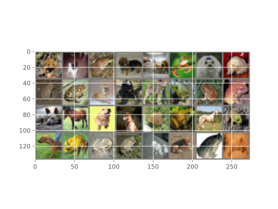

We include the CIFAR-10 dataset, which
is frequently used in literature and considered a standard deep learning dataset. CIFAR-10 consists of 50,000 training and 10,000 test images, split into ten classes of 6000 32x32
pixel images each.

## Example Data



```
Krizhevsky, Alex, Geoffrey Hinton, and Others. 2009. 
“Learning Multiple Layers of Features from Tiny Images.”
```