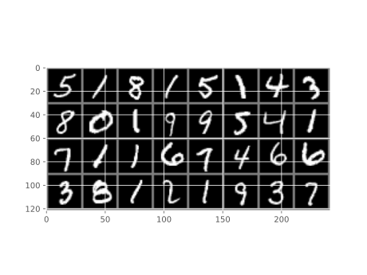

We integrated the MNIST dataset into the tool. The MNIST dataset consists of 70,000 handwritten digits, split into 10,000 test and 60,000 training images. We included the MNIST dataset to enable quicker testing, as the complexity is significantly lower than CIFAR-10.

## Example Data



```
LeCun, Yann, Corinna Cortes, and C. J. Burges. n.d. 
“MNIST Handwritten Digit Database.” 
ATT Labs [Online]. Available: Http://yann.Lecun.Com/exdb/mnist.
```