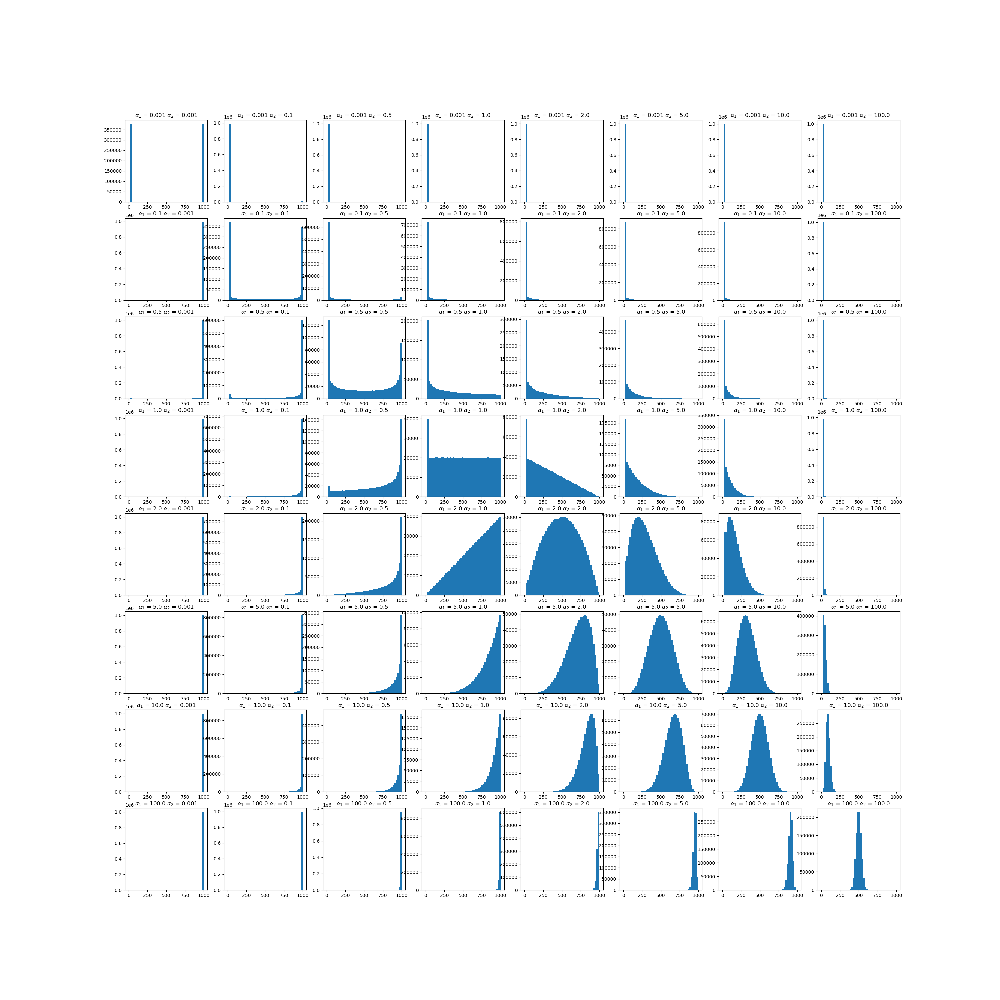

The second type is a Dirichlet distribution that allocates a different number of samples to
each client. In this case, each client receives a different percentage of the whole dataset. In
total, the number of samples distributed is equal to the length of the dataset. Once again,
samples are selected with replacement from the entire training set. 

### Parameters

| Key                            | Description                                        | Example Value |
|--------------------------------|----------------------------------------------------|---------------|
| data_quantity_skew_parameter_1 | Parameter 1 for the dirichlet distribution         | 0.5           |
| data_quantity_skew_parameter_2 | Parameter 2 for the dirichlet distribution         | 5.0           |
| data_quantity_min_parameter    | Minimum number of samples to assign to each client | 1             |
| data_quantity_max_parameter    | Maximum number of samples to assign to each client | 1000          |


### Example distributions


Adapted from:
```
Li, Qinbin, Yiqun Diao, Quan Chen, and Bingsheng He. 2022. 
“Federated Learning on Non-IID Data Silos: An Experimental Study.” 
In 2022 IEEE 38th International Conference on Data Engineering (ICDE). IEEE. 
https://doi.org/10.1109/icde53745.2022.00077.
```
