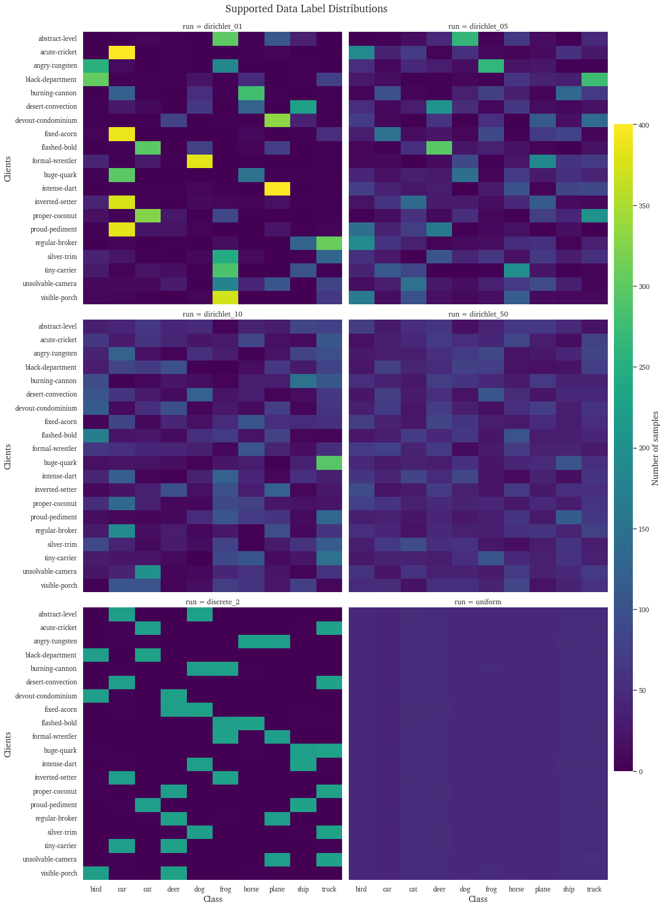

# Generate Data Distribution Heatmaps

This notebook provides code for generating a data distribution heatmap from the files in the data_distribution  folder.

## Imports


```python
from os import listdir
from os.path import isfile, join
from statistics import fmean

import pandas as pd
from matplotlib import cm
from matplotlib.colors import Normalize

pd.options.mode.chained_assignment = None  # default='warn'
import json
import numpy as np
import matplotlib.pyplot as plt
import matplotlib as mpl
import seaborn as sns
```

## File loading


```python
file_list = [f for f in listdir("outputs") if isfile(join("outputs", f))]
dfs = []
for i in range(len(file_list)):
    fname = "outputs/" + file_list[i]
    df_temp = pd.read_csv(fname)
    df_temp.set_index(['client'], inplace=True)
    df_temp['run'] = file_list[i].replace(".csv", "")
    dfs.append(df_temp)
df = pd.concat(dfs).reset_index()
```

## Dataframe preparation


```python
df = df.melt(id_vars=["client", "run"], var_name="class").fillna(0)
df['run'] = df['run'].astype("category")
```

## Wrapper for drawing the heatmaps


```python
def draw_heatmap(*args, **kwargs):
    data = kwargs.pop('data')
    d = data.pivot(index=args[0], columns=args[1], values=args[2])
    sns.heatmap(d, **kwargs)
```

## Plotting


```python
mpl.rcParams['font.family'] = "serif"
mpl.rcParams['font.serif'] = "Charter"
sns.set_style("ticks")
sns.set_theme(font="Charter")
g = sns.FacetGrid(df, col="run", col_wrap=2, sharey=True, sharex=True, xlim=(0.5,1.0), height=7, aspect=1)
cbar_ax = g.fig.add_axes([1, .15, .03, .7])

g.map_dataframe(draw_heatmap, 'client', 'class', 'value', cbar=True, square = False, vmin=0, vmax=400, cmap='viridis', cbar_ax=cbar_ax)
cbar_ax.set_ylabel("Number of samples", fontproperties={'family': 'Charter'},fontsize='x-large')
g.set_xlabels("Class", fontproperties={'family': 'Charter'},fontsize='x-large')
g.set_ylabels("Clients", fontproperties={'family': 'Charter'},fontsize='x-large')
g.fig.subplots_adjust(top=0.95)
axs = g.axes_dict
g.fig.suptitle("Supported Data Label Distributions", fontsize='xx-large', fontproperties={'family': 'Charter'})
g.show()
```

    /home/jsteimle/anaconda3/envs/Flower/lib/python3.11/site-packages/seaborn/axisgrid.py:118: UserWarning: This figure includes Axes that are not compatible with tight_layout, so results might be incorrect.
      self._figure.tight_layout(*args, **kwargs)


    

    

