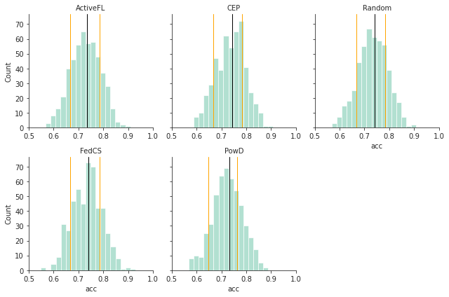
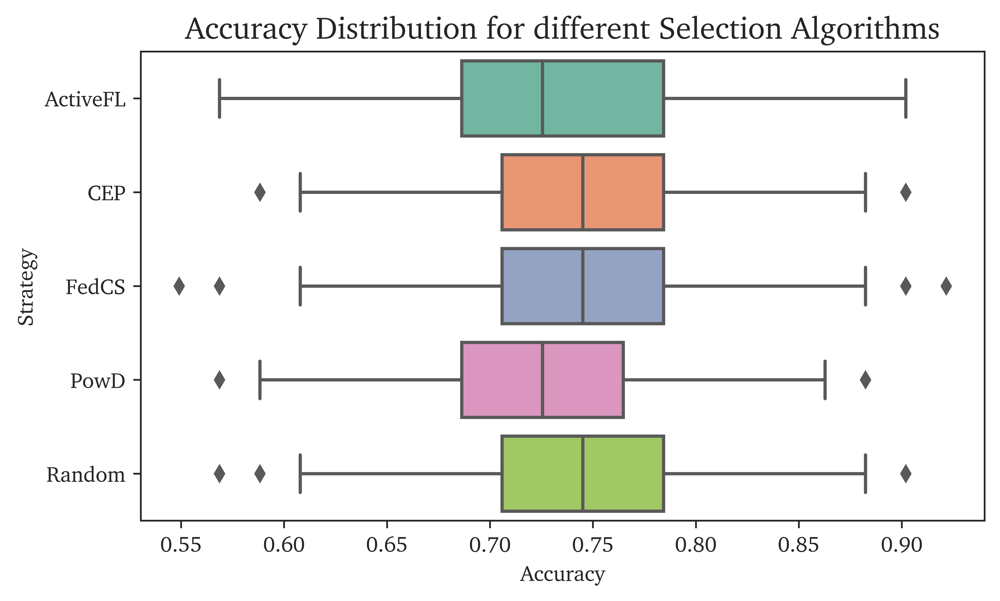
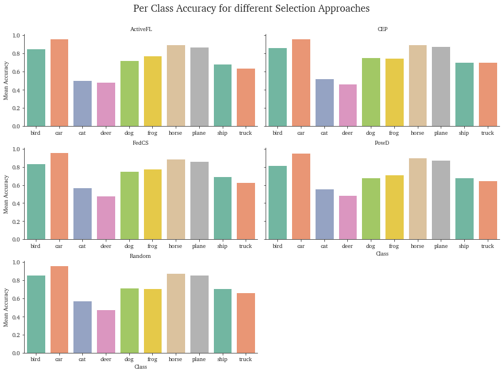

# Fairness metrics

## Imports


```python
import pandas as pd
from os import listdir, getcwd
from os.path import isfile, join
import seaborn as sns
import matplotlib.pyplot as plt
import ast
```

## Data import
The import script is designed to import and average multiple runs. You can adjust your run folders accordingly.


```python
run_folders = ['run_1']
```


```python
dfs = []
for folder in run_folders:
    run_folder = folder + "/validation/"
    file_list = [f for f in listdir(run_folder) if isfile(join(run_folder, f))]
    print("Loaded", file_list, "from", run_folders)
    for i in range(len(file_list)):
        fname = run_folder + file_list[i]
        df_temp = pd.read_csv(fname)
        df_temp["src"] = file_list[i].replace(".csv", "")
        df_temp["run"] = folder
        dfs.append(df_temp)
df = pd.concat(dfs)
```

    Loaded ['ActiveFL.csv', 'CEP.csv', 'Random.csv', 'FedCS.csv', 'PowD.csv'] from ['run_1']


## Dataframe Preview


```python
df
```


<div>
<style scoped>
    .dataframe tbody tr th:only-of-type {
        vertical-align: middle;
    }

    .dataframe tbody tr th {
        vertical-align: top;
    }

    .dataframe thead th {
        text-align: right;
    }
</style>
<table border="1" class="dataframe">
  <thead>
    <tr style="text-align: right;">
      <th></th>
      <th>round</th>
      <th>client</th>
      <th>loss</th>
      <th>acc</th>
      <th>total</th>
      <th>correct</th>
      <th>class_accuracy</th>
      <th>src</th>
      <th>run</th>
    </tr>
  </thead>
  <tbody>
    <tr>
      <th>0</th>
      <td>0</td>
      <td>burning-field</td>
      <td>NaN</td>
      <td>0.117647</td>
      <td>51</td>
      <td>6</td>
      <td>[0.11764705926179886, 0.0, 0.0, 0.0, 0.0, 0.0,...</td>
      <td>ActiveFL</td>
      <td>run_1</td>
    </tr>
    <tr>
      <th>1</th>
      <td>0</td>
      <td>buoyant-eaves</td>
      <td>NaN</td>
      <td>0.117647</td>
      <td>51</td>
      <td>6</td>
      <td>[0.11764705926179886, 0.0, 0.0, 0.0, 0.0, 0.0,...</td>
      <td>ActiveFL</td>
      <td>run_1</td>
    </tr>
    <tr>
      <th>2</th>
      <td>0</td>
      <td>deafening-adhesive</td>
      <td>NaN</td>
      <td>0.117647</td>
      <td>51</td>
      <td>6</td>
      <td>[0.11764705926179886, 0.0, 0.0, 0.0, 0.0, 0.0,...</td>
      <td>ActiveFL</td>
      <td>run_1</td>
    </tr>
    <tr>
      <th>3</th>
      <td>0</td>
      <td>swarm-canity</td>
      <td>NaN</td>
      <td>0.117647</td>
      <td>51</td>
      <td>6</td>
      <td>[0.11764705926179886, 0.0, 0.0, 0.0, 0.0, 0.0,...</td>
      <td>ActiveFL</td>
      <td>run_1</td>
    </tr>
    <tr>
      <th>4</th>
      <td>0</td>
      <td>amiable-wolverine</td>
      <td>NaN</td>
      <td>0.117647</td>
      <td>51</td>
      <td>6</td>
      <td>[0.11764705926179886, 0.0, 0.0, 0.0, 0.0, 0.0,...</td>
      <td>ActiveFL</td>
      <td>run_1</td>
    </tr>
    <tr>
      <th>...</th>
      <td>...</td>
      <td>...</td>
      <td>...</td>
      <td>...</td>
      <td>...</td>
      <td>...</td>
      <td>...</td>
      <td>...</td>
      <td>...</td>
    </tr>
    <tr>
      <th>14995</th>
      <td>29</td>
      <td>cold-reef</td>
      <td>0.026430</td>
      <td>0.745098</td>
      <td>51</td>
      <td>38</td>
      <td>[0.8333333134651184, 1.0, 0.6666666865348816, ...</td>
      <td>PowD</td>
      <td>run_1</td>
    </tr>
    <tr>
      <th>14996</th>
      <td>29</td>
      <td>blue-bat</td>
      <td>0.036713</td>
      <td>0.686275</td>
      <td>51</td>
      <td>35</td>
      <td>[1.0, 1.0, 1.0, 0.4285714328289032, 0.33333334...</td>
      <td>PowD</td>
      <td>run_1</td>
    </tr>
    <tr>
      <th>14997</th>
      <td>29</td>
      <td>damp-actuary</td>
      <td>0.035672</td>
      <td>0.627451</td>
      <td>51</td>
      <td>32</td>
      <td>[1.0, 0.8888888955116272, 0.6000000238418579, ...</td>
      <td>PowD</td>
      <td>run_1</td>
    </tr>
    <tr>
      <th>14998</th>
      <td>29</td>
      <td>local-yield</td>
      <td>0.025788</td>
      <td>0.745098</td>
      <td>51</td>
      <td>38</td>
      <td>[0.8333333134651184, 0.8888888955116272, 0.857...</td>
      <td>PowD</td>
      <td>run_1</td>
    </tr>
    <tr>
      <th>14999</th>
      <td>29</td>
      <td>vivid-certificate</td>
      <td>0.040833</td>
      <td>0.607843</td>
      <td>51</td>
      <td>31</td>
      <td>[0.75, 1.0, 0.5, 0.3333333432674408, 0.5, 0.66...</td>
      <td>PowD</td>
      <td>run_1</td>
    </tr>
  </tbody>
</table>
<p>75000 rows × 9 columns</p>
</div>


## Client Fairness

### Final Round Fairness Histograms


```python
df_plot = df[df['round'] == max(df['round'])][['acc', 'src', 'client']]
plt.figure(figsize=(7,4), dpi=1200)
sns.set_style("ticks")
g = sns.FacetGrid(df_plot, col="src", col_wrap=3, sharey='row', sharex=False, xlim=(0.5,1.0))
g.map(sns.histplot, "acc", bins=10, binwidth=0.02, palette="Set2", hue=len(df.index))
g.set_titles("{col_name}")
for (row, col, hue_idx), data in g.facet_data():
    if not data.values.size:
        continue
    ax = g.facet_axis(row, col)
    ax.axvline(data["acc"].mean(), c="k", ls="-", lw=1, label="Mean")
    ax.axvline(data["acc"].quantile(.1), c="orange", ls="-", lw=1)
    ax.axvline(data["acc"].quantile(.75), c="orange", ls="-", lw=1)
plt.show()
```


    

    


### Fairness Boxplots


```python
df_plot = df[df['round'] == max(df['round'])][['acc', 'src', 'client']]
df_plot = df_plot.groupby(["client", "src"]).mean().reset_index()
plt.figure(figsize=(7,4), dpi=1200)
sns.set_style("ticks")
plt.rcParams['font.family'] = "serif"
plt.rcParams['font.serif'] = "Charter"
ax = sns.boxplot(df_plot, x='acc', y='src', palette="Set2")
ax.set_xlabel("Accuracy")
ax.set_ylabel("Strategy")
ax.set_title("Accuracy Distribution for different Selection Algorithms", fontsize="x-large")
plt.show()
```


    

    


## Class Fairness

### Define CIFAR-10 Classes


```python
classes = (
            "plane",
            "car",
            "bird",
            "cat",
            "deer",
            "dog",
            "frog",
            "horse",
            "ship",
            "truck",
        )
```

### Class Accuracy Plots


```python
df_plot = df[df['round'] == max(df['round'])][['class_accuracy', 'src', 'run']]
df_plot['class_accuracy']=df_plot['class_accuracy'].apply(lambda x: ast.literal_eval(x))
df_temps = []
for i in df_plot['src'].unique():
    df_temp = pd.DataFrame(df_plot[df_plot['src'] == i]['class_accuracy'].to_list(), columns=classes)
    df_temp['src'] = i
    df_temps.append(df_temp)
df_plot = pd.concat(df_temps).groupby(['src']).mean().reset_index()
df_plot = df_plot.melt(id_vars=['src'], var_name='class', value_name='acc')
df_plot['class'] = df_plot['class'].astype('category')
df_plot['color'] = 1

plt.figure(figsize=(7,4), dpi=1200)
sns.set_style("ticks")
plt.rcParams['font.family'] = "serif"
plt.rcParams['font.serif'] = "Charter"
axs = sns.catplot(
    df_plot, x="class", y='acc', col="src", height=3, aspect=2, col_wrap=2,
    kind="bar", margin_titles=True, palette="Set2", legend=None, sharex=False
)
axs.set_titles("{col_name}")
axs.set_xlabels("Class")
axs.set_ylabels("Mean Accuracy")
axs.fig.suptitle("Per Class Accuracy for different Selection Approaches", fontsize='xx-large', fontproperties={'family': 'Charter'})
axs.fig.subplots_adjust(top=0.9)
plt.show()
```
    

    

