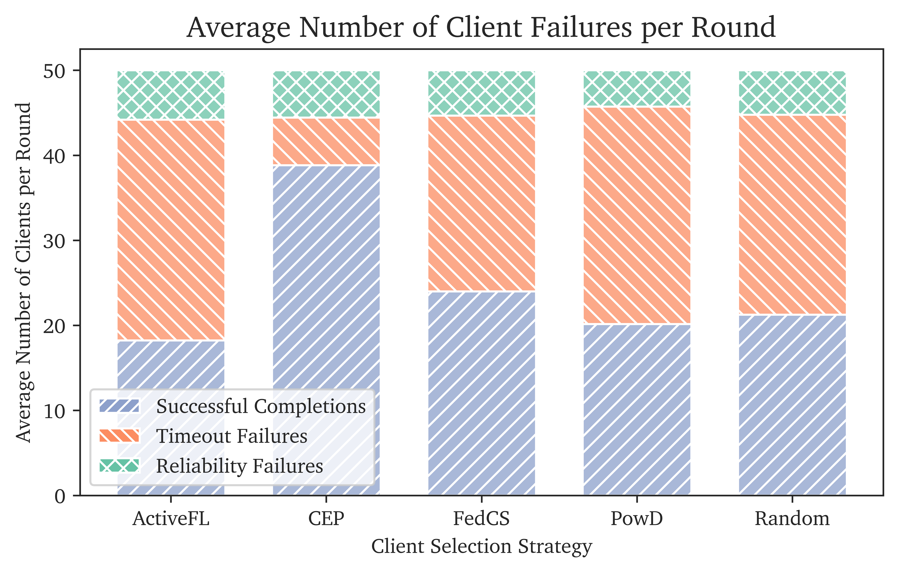

# Training Failure Metrics

## Imports


```python
import pandas as pd
from os import listdir, getcwd
from os.path import isfile, join
import seaborn as sns
import matplotlib.pyplot as plt
import json
import numpy as np
import itertools
import matplotlib.patches as mpatches
pd.options.mode.chained_assignment = None  # default='warn'
```

## Data Import
This notebook can be used to compute and average results across multiple runs, simply adapt the run_folders.


```python
run_folders = ['run_1']
```


```python
dfs = []
for folder in run_folders:
    run_folder = folder + "/client_output/"
    file_list = [f for f in listdir(run_folder) if isfile(join(run_folder, f))]
    print("Loaded", file_list, "from", run_folder)
    for i in range(len(file_list)):
        file_dfs = []
        with open(run_folder + file_list[i]) as f:
            for line in f.readlines():
                json_data = pd.json_normalize(json.loads(line))
                file_dfs.append(json_data)
        file_df = pd.concat(file_dfs)
        file_df["src"] = file_list[i].replace(".json", "")
        file_df["run"] = folder
        dfs.append(file_df)
df = pd.concat(dfs)
```

    Loaded ['Random.json', 'FedCS.json', 'ActiveFL.json', 'PowD.json', 'CEP.json'] from run_1/client_output/


## Dataset Preparation


```python
df['server_round'] = np.where(df['server_round'] == max(df['server_round']), 0, df['server_round'])
```


```python
df['reason'] = df['reason'].fillna("success")
```

## DataFrame Preview


```python
df.sample(2)
```


<div>
<style scoped>
    .dataframe tbody tr th:only-of-type {
        vertical-align: middle;
    }

    .dataframe tbody tr th {
        vertical-align: top;
    }

    .dataframe thead th {
        text-align: right;
    }
</style>
<table border="1" class="dataframe">
  <thead>
    <tr style="text-align: right;">
      <th></th>
      <th>server_round</th>
      <th>client_name</th>
      <th>actual_execution_time</th>
      <th>execution_time</th>
      <th>upload_time</th>
      <th>total_time</th>
      <th>status</th>
      <th>current_timestamp</th>
      <th>state.cpu</th>
      <th>state.ram</th>
      <th>...</th>
      <th>state.performance_tier</th>
      <th>state.expected_execution_time</th>
      <th>state.i_performance_factor</th>
      <th>state.client_name</th>
      <th>train_output.accuracy</th>
      <th>train_output.avg_epoch_loss</th>
      <th>train_output.no_samples</th>
      <th>reason</th>
      <th>src</th>
      <th>run</th>
    </tr>
  </thead>
  <tbody>
    <tr>
      <th>0</th>
      <td>1</td>
      <td>slow-sump</td>
      <td>NaN</td>
      <td>88.0</td>
      <td>49.450109</td>
      <td>120.000000</td>
      <td>fail</td>
      <td>2023-08-11 16:04:18.782893</td>
      <td>8</td>
      <td>32</td>
      <td>...</td>
      <td>2</td>
      <td>80</td>
      <td>1.10</td>
      <td>slow-sump</td>
      <td>NaN</td>
      <td>NaN</td>
      <td>NaN</td>
      <td>timeout failure</td>
      <td>Random</td>
      <td>run_1</td>
    </tr>
    <tr>
      <th>0</th>
      <td>10</td>
      <td>level-platform</td>
      <td>1.203034</td>
      <td>92.0</td>
      <td>14.012158</td>
      <td>106.012158</td>
      <td>success</td>
      <td>2023-08-11 17:53:05.487195</td>
      <td>8</td>
      <td>32</td>
      <td>...</td>
      <td>2</td>
      <td>80</td>
      <td>1.15</td>
      <td>level-platform</td>
      <td>[0.44468546637744033, 0.7613882863340564, 0.91...</td>
      <td>[0.05063865914003451, 0.025299487623371943, 0....</td>
      <td>15.0</td>
      <td>success</td>
      <td>ActiveFL</td>
      <td>run_1</td>
    </tr>
  </tbody>
</table>
<p>2 rows × 22 columns</p>
</div>


## Generate average failures per round table


```python
df_gen = df[['server_round', 'src', 'run', 'reason']]
df_gen = df_gen.groupby(['src', 'reason', 'run']).count()
df_gen['server_round'] = df_gen['server_round'] / 30
df_gen = df_gen.groupby(['src', 'reason']).mean().reset_index()
df_gen = df_gen.pivot_table(index="src",columns="reason", values="server_round").reset_index() 
df_gen['Total Failures'] = df_gen['reliability failure'] + df_gen['timeout failure']
df_gen['Total Clients'] = df_gen['Total Failures'] + df_gen['success']
df_gen['Total Clients'] = df_gen['Total Clients'].astype(int)
df_gen.columns = ['Strategy', 'Reliability Failures', 'Successful Participations', 'Timeout Failures', 'Total Failures', 'Total Clients']
cols = ['Strategy', 'Successful Participations', 'Reliability Failures', 'Timeout Failures', 'Total Failures', 'Total Clients']
df_gen = df_gen[cols]
df_gen
# df_gen.to_latex('mean_failures_per_round.tex',
#                   formatters={"name": "{:.2f}".format},
#                   float_format="{:.2f}".format,
#                    index=None)
```


<div>
<style scoped>
    .dataframe tbody tr th:only-of-type {
        vertical-align: middle;
    }

    .dataframe tbody tr th {
        vertical-align: top;
    }

    .dataframe thead th {
        text-align: right;
    }
</style>
<table border="1" class="dataframe">
  <thead>
    <tr style="text-align: right;">
      <th></th>
      <th>Strategy</th>
      <th>Successful Participations</th>
      <th>Reliability Failures</th>
      <th>Timeout Failures</th>
      <th>Total Failures</th>
      <th>Total Clients</th>
    </tr>
  </thead>
  <tbody>
    <tr>
      <th>0</th>
      <td>ActiveFL</td>
      <td>18.233333</td>
      <td>5.800000</td>
      <td>25.966667</td>
      <td>31.766667</td>
      <td>50</td>
    </tr>
    <tr>
      <th>1</th>
      <td>CEP</td>
      <td>38.833333</td>
      <td>5.566667</td>
      <td>5.600000</td>
      <td>11.166667</td>
      <td>50</td>
    </tr>
    <tr>
      <th>2</th>
      <td>FedCS</td>
      <td>24.000000</td>
      <td>5.333333</td>
      <td>20.666667</td>
      <td>26.000000</td>
      <td>50</td>
    </tr>
    <tr>
      <th>3</th>
      <td>PowD</td>
      <td>20.166667</td>
      <td>4.266667</td>
      <td>25.566667</td>
      <td>29.833333</td>
      <td>50</td>
    </tr>
    <tr>
      <th>4</th>
      <td>Random</td>
      <td>21.266667</td>
      <td>5.233333</td>
      <td>23.500000</td>
      <td>28.733333</td>
      <td>50</td>
    </tr>
  </tbody>
</table>
</div>


## Failures per Round Diagram


```python
nice_name_map = {'reliability failure': 'Reliability Failure', 'timeout failure':'Timeout', 'success': 'Successful Completion'}
df_gen = df[['server_round', 'src', 'run', 'reason']]
df_gen['reason'] = df_gen['reason'].apply(lambda x: nice_name_map[x])
df_gen = df_gen.groupby(['src', 'reason', 'run']).count()
df_gen['server_round'] = df_gen['server_round'] / len(df['server_round'].unique())
df_gen = df_gen.groupby(['src', 'reason']).mean().reset_index()
df_gen['Status'] = pd.Categorical(df_gen['reason'], ['Reliability Failure', 'Timeout', 'Successful Completion'])
df_gen
```


<div>
<style scoped>
    .dataframe tbody tr th:only-of-type {
        vertical-align: middle;
    }

    .dataframe tbody tr th {
        vertical-align: top;
    }

    .dataframe thead th {
        text-align: right;
    }
</style>
<table border="1" class="dataframe">
  <thead>
    <tr style="text-align: right;">
      <th></th>
      <th>src</th>
      <th>reason</th>
      <th>server_round</th>
      <th>Status</th>
    </tr>
  </thead>
  <tbody>
    <tr>
      <th>0</th>
      <td>ActiveFL</td>
      <td>Reliability Failure</td>
      <td>5.800000</td>
      <td>Reliability Failure</td>
    </tr>
    <tr>
      <th>1</th>
      <td>ActiveFL</td>
      <td>Successful Completion</td>
      <td>18.233333</td>
      <td>Successful Completion</td>
    </tr>
    <tr>
      <th>2</th>
      <td>ActiveFL</td>
      <td>Timeout</td>
      <td>25.966667</td>
      <td>Timeout</td>
    </tr>
    <tr>
      <th>3</th>
      <td>CEP</td>
      <td>Reliability Failure</td>
      <td>5.566667</td>
      <td>Reliability Failure</td>
    </tr>
    <tr>
      <th>4</th>
      <td>CEP</td>
      <td>Successful Completion</td>
      <td>38.833333</td>
      <td>Successful Completion</td>
    </tr>
    <tr>
      <th>5</th>
      <td>CEP</td>
      <td>Timeout</td>
      <td>5.600000</td>
      <td>Timeout</td>
    </tr>
    <tr>
      <th>6</th>
      <td>FedCS</td>
      <td>Reliability Failure</td>
      <td>5.333333</td>
      <td>Reliability Failure</td>
    </tr>
    <tr>
      <th>7</th>
      <td>FedCS</td>
      <td>Successful Completion</td>
      <td>24.000000</td>
      <td>Successful Completion</td>
    </tr>
    <tr>
      <th>8</th>
      <td>FedCS</td>
      <td>Timeout</td>
      <td>20.666667</td>
      <td>Timeout</td>
    </tr>
    <tr>
      <th>9</th>
      <td>PowD</td>
      <td>Reliability Failure</td>
      <td>4.266667</td>
      <td>Reliability Failure</td>
    </tr>
    <tr>
      <th>10</th>
      <td>PowD</td>
      <td>Successful Completion</td>
      <td>20.166667</td>
      <td>Successful Completion</td>
    </tr>
    <tr>
      <th>11</th>
      <td>PowD</td>
      <td>Timeout</td>
      <td>25.566667</td>
      <td>Timeout</td>
    </tr>
    <tr>
      <th>12</th>
      <td>Random</td>
      <td>Reliability Failure</td>
      <td>5.233333</td>
      <td>Reliability Failure</td>
    </tr>
    <tr>
      <th>13</th>
      <td>Random</td>
      <td>Successful Completion</td>
      <td>21.266667</td>
      <td>Successful Completion</td>
    </tr>
    <tr>
      <th>14</th>
      <td>Random</td>
      <td>Timeout</td>
      <td>23.500000</td>
      <td>Timeout</td>
    </tr>
  </tbody>
</table>
</div>


```python
plt.figure(figsize=(7,4), dpi=1200)
sns.set_style("ticks")
plt.rcParams['font.family'] = "serif"
plt.rcParams['font.serif'] = "Charter"
ax = sns.histplot(x = 'src', hue = 'Status',multiple = 'stack', weights="server_round", data=df_gen,shrink = 0.7, palette="Set2")
ax.set_xlabel("Client Selection Strategy")
ax.set_ylabel("Average Number of Clients per Round")
no_status = 5
hatches = itertools.cycle(['///', '\\\\\\', 'XXX'])
for i, bar in enumerate(ax.patches):
    if i % no_status == 0:
         hatch = next(hatches)
    bar.set_hatch(hatch)
colors = sns.color_palette("Set2")
circ1 = mpatches.Patch(facecolor=colors[2], hatch='////',label='Successful Completions')
circ2= mpatches.Patch(facecolor=colors[1], hatch=r'\\\\',label='Timeout Failures')
circ3 = mpatches.Patch(facecolor=colors[0], hatch='XXX',label='Reliability Failures')

ax.legend(handles = [circ1,circ2,circ3],loc=0)
ax.set_title("Average Number of Client Failures per Round", fontsize='x-large')
plt.show()
```


    

    

